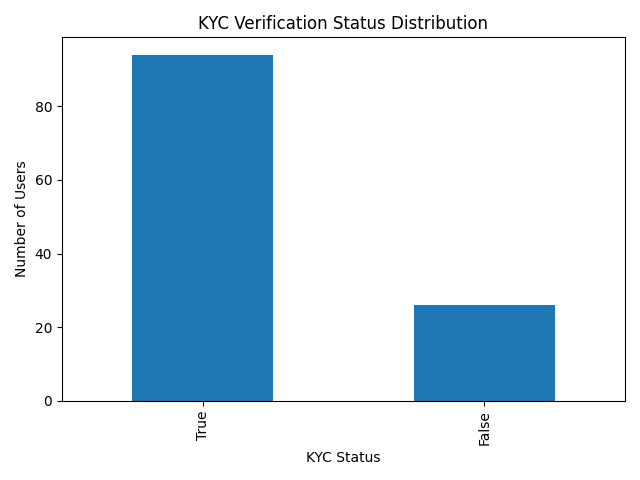
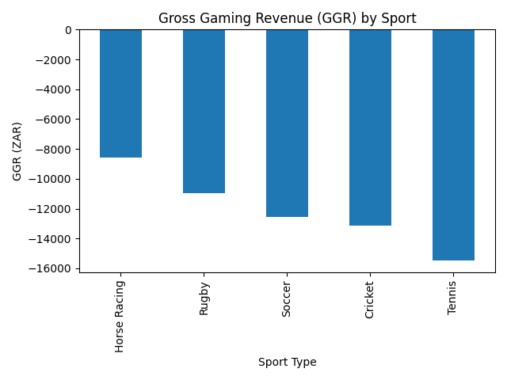
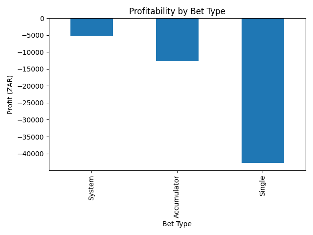

# South Africa Sports Betting Analytics (Python)

## 📌 Project Overview
This project simulates a real-world sports betting platform operating in the South African market.  
The objective is to analyze customer behavior, betting activity, and profitability using Python.

The dataset includes:
- User registrations & KYC verification
- Sports events across multiple leagues
- Betting transactions with odds, stakes, and payouts

---

## 🧱 Dataset Structure

### Users Table
- user_id
- username
- registration_date
- kyc_status
- total_deposits

### Events Table
- event_id
- event_start
- sport_type
- league_name

### Bets Table
- bet_id
- user_id
- event_id
- bet_timestamp
- stake_amount
- odds
- bet_type
- market_type
- bet_status
- payout_amount

---

## 📊 Key Business Questions Answered

- What percentage of users have completed KYC?
- Do KYC-verified users deposit more?
- Who are the highest-value customers?
- What is the platform’s Gross Gaming Revenue (GGR)?
- Which sports and bet types are most profitable?

---

## 📈 Key Visual Outputs

### KYC Status Distribution


### Gross Gaming Revenue by Sport


### Profitability by Bet Type


---

## 🛠 Tools & Technologies
- Python
- Pandas
- Matplotlib
- Excel (data source)
- VS Code

---

## ▶️ How to Run the Project

```bash
python -m venv venv
venv\Scripts\activate


pip install -r requirements.txt
python analysis.py
